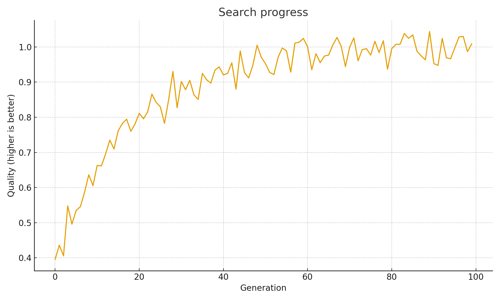
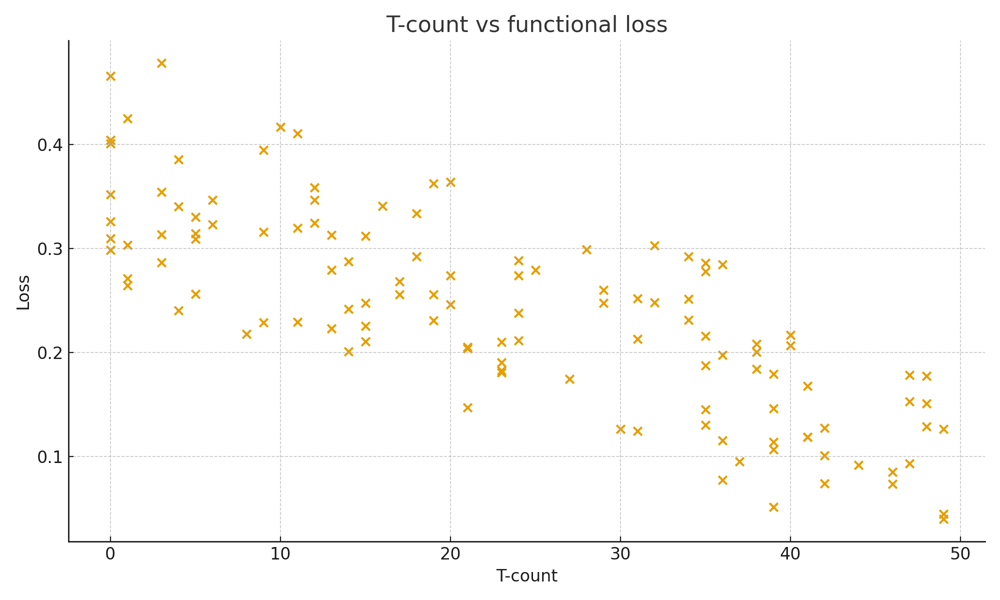
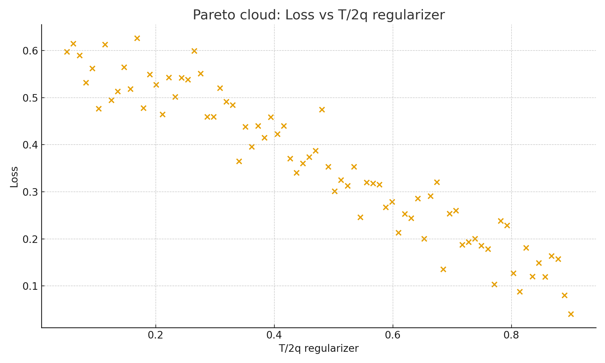

# Low-T Quantum Adder (Clifford+T) via Genetic Algorithm

**Goal:** Evolve shallow, hardware-friendly **Clifford+T** circuits for in-place addition  
`|a,b⟩ → |a, a+b (mod 2^n)|`, minimizing **T-count / T-depth** and overall cost.

> Full write-up: **[REPORT.md](./REPORT.md)**

---

## 🧠 Highlights
- Genetic Algorithm search over `{x, h, s, t, tdg, cx}` (Clifford+T gate set)
- Metrics: functional loss, **T-count**, **T-depth**, total **depth**, **#2-qubit gates**
- Baseline: **Draper QFT adder** for comparison
- Optional **Pareto (NSGA-II)** framing to explore fidelity vs. resources

---

## 📈 Example Results
<p>
  
  
  
</p>

See the report for discussion and a comparison table.

---

## 🚀 How to Run

### Option A — Jupyter (notebook)
```bash
python3 -m venv .venv
source .venv/bin/activate
python -m pip install --upgrade pip
pip install -r requirements.txt

jupyter notebook low_t_adder_ga.ipynb
